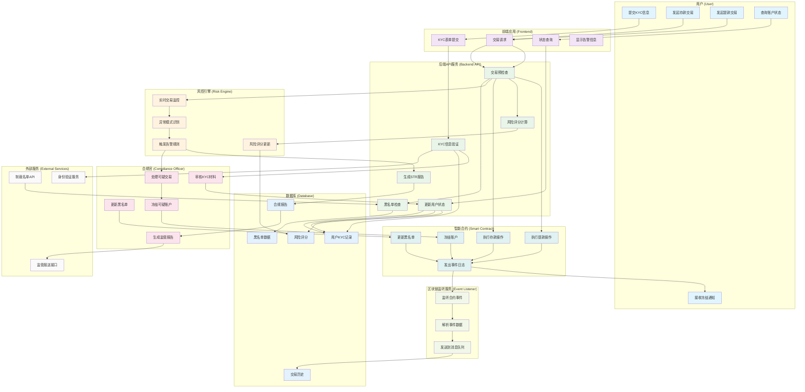
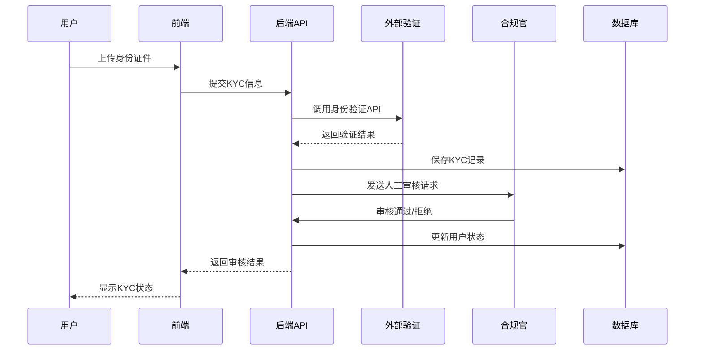
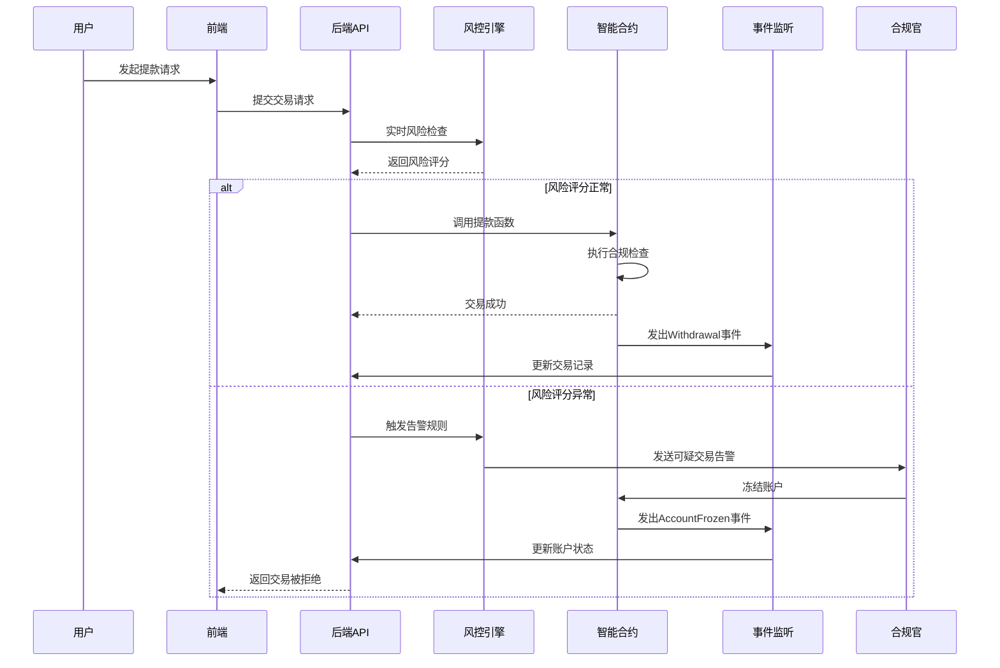
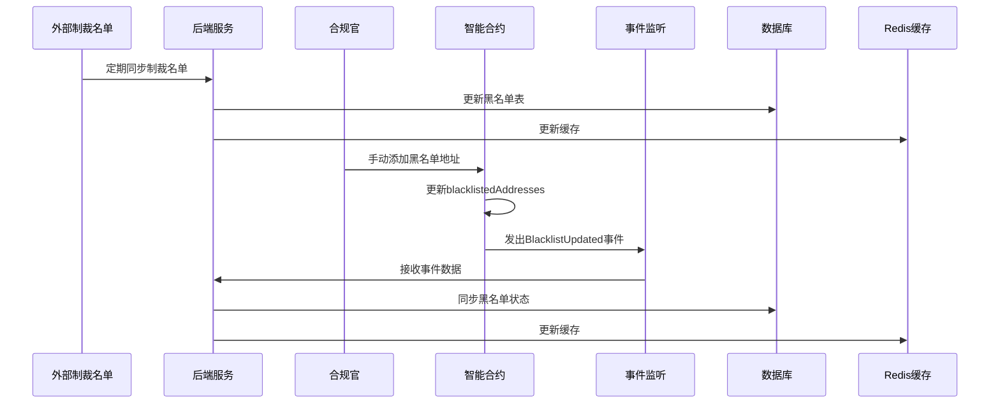
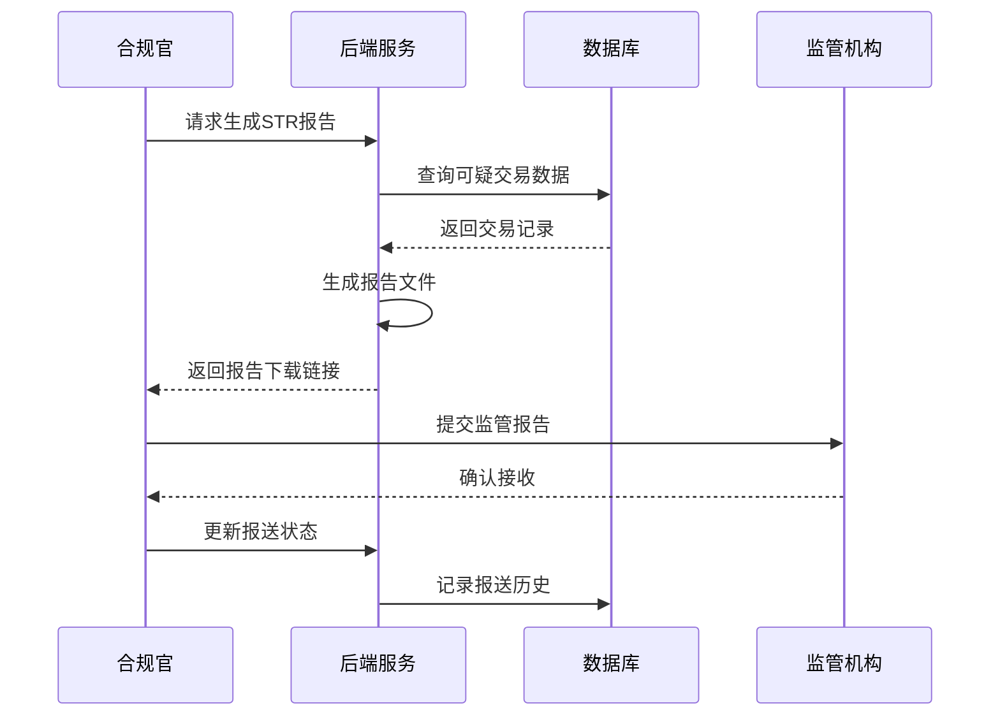

# 中心化托管系统 - 风控合规服务泳道图

## 详细业务流程说明

### 1. KYC身份验证流程

### 2. 交易监控与风控流程

### 3. 黑名单管理流程

### 4. 合规报告生成流程

## 关键角色职责

### 👤 用户 (User)
- 提交KYC身份验证材料
- 发起存款/提款交易
- 查询账户状态和交易历史
- 接收系统通知和告警

### 🖥️ 前端应用 (Frontend)
- 提供用户交互界面
- 表单验证和数据提交
- 显示账户状态和告警信息
- 实时更新交易状态

### ⚙️ 后端API服务 (Backend API)
- 处理业务逻辑
- 数据验证和存储
- 调用外部服务
- 生成合规报告

### 🛡️ 风控引擎 (Risk Engine)
- 实时交易监控
- 异常模式识别
- 风险评分计算
- 告警规则触发

### 👨‍💼 合规官 (Compliance Officer)
- KYC材料人工审核
- 可疑交易调查
- 黑名单维护
- 监管报告生成

### 📜 智能合约 (Smart Contract)
- 资金托管和转移
- 合规规则执行
- 账户状态管理
- 事件日志记录

### 👂 事件监听服务 (Event Listener)
- 监听区块链事件
- 数据解析和转换
- 消息队列分发
- 数据同步

这个泳道图完整展示了中心化托管系统中各个角色的交互流程，确保了合规性、安全性和可追溯性。