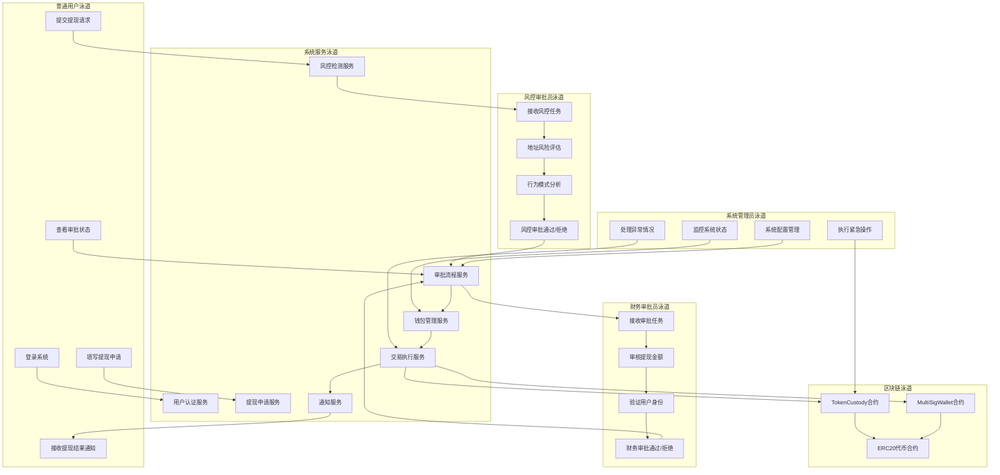
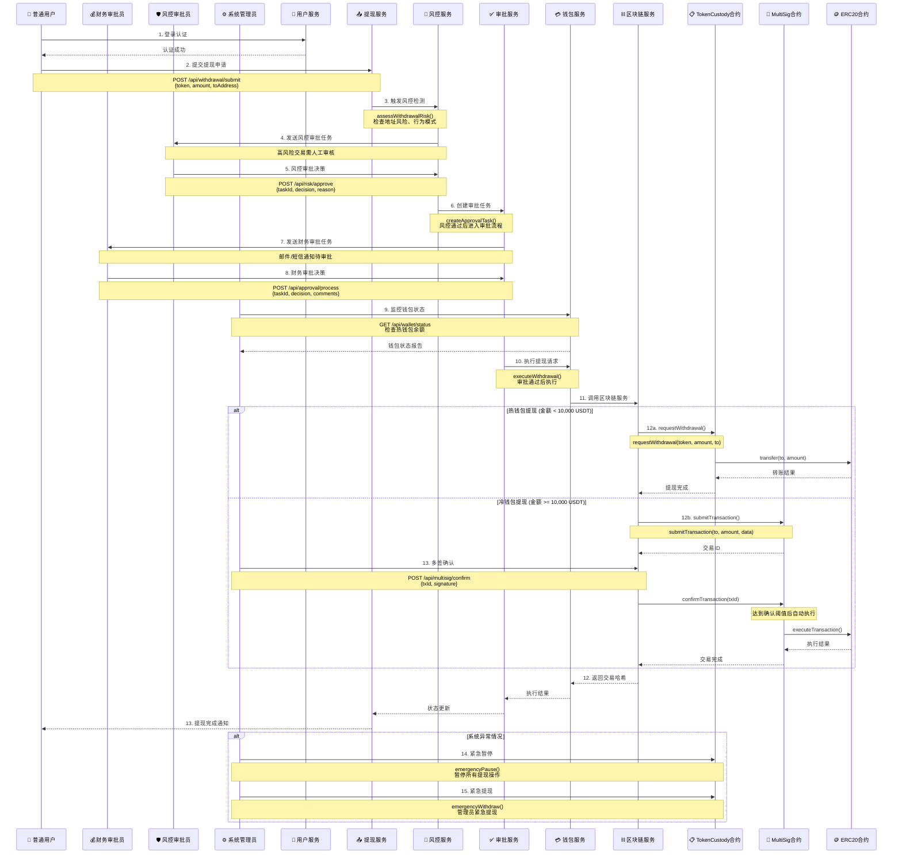

# 中心化托管系统提现流程泳道图

## 系统角色泳道图

## 详细提现流程泳道图

## 角色权限矩阵

| 角色 | 权限范围 | 主要操作 | 调用接口 |
|------|----------|----------|----------|
| 👤 **普通用户** | 个人账户 | 提现申请、状态查询 | `/api/withdrawal/submit` `/api/withdrawal/status` |
| 💰 **财务审批员** | 财务审批 | 审批提现请求、查看财务报表 | `/api/approval/process` `/api/reports/financial` |
| 🛡️ **风控审批员** | 风险控制 | 风险评估、黑名单管理 | `/api/risk/assess` `/api/risk/blacklist` |
| ⚙️ **系统管理员** | 系统管理 | 系统配置、紧急操作、多签确认 | `/api/system/config` `/api/emergency/*` `/api/multisig/confirm` |

## 关键决策点

### 1. 风控决策点
- **触发条件**: 地址风险评分 > 80 或 单日提现超限
- **决策者**: 风控审批员
- **处理时间**: 2小时内

### 2. 财务审批决策点
- **触发条件**: 金额 > 1,000 USDT
- **决策者**: 财务审批员
- **处理时间**: 4小时内

### 3. 钱包选择决策点
- **热钱包**: 金额 < 10,000 USDT，自动执行
- **冷钱包**: 金额 >= 10,000 USDT，需要多签确认

### 4. 紧急处理决策点
- **触发条件**: 系统异常、安全威胁
- **决策者**: 系统管理员
- **处理方式**: 立即暂停、紧急提现

## 监控指标

- **用户操作**: 提现申请数量、成功率
- **审批效率**: 平均审批时间、审批通过率
- **风控效果**: 风险交易拦截率、误报率
- **系统性能**: 交易处理速度、系统可用性
- **资金安全**: 钱包余额、异常交易监控